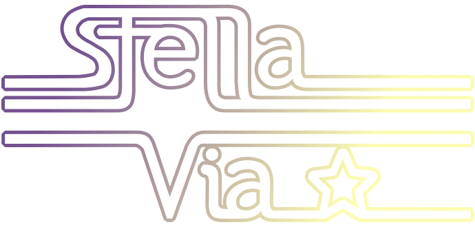
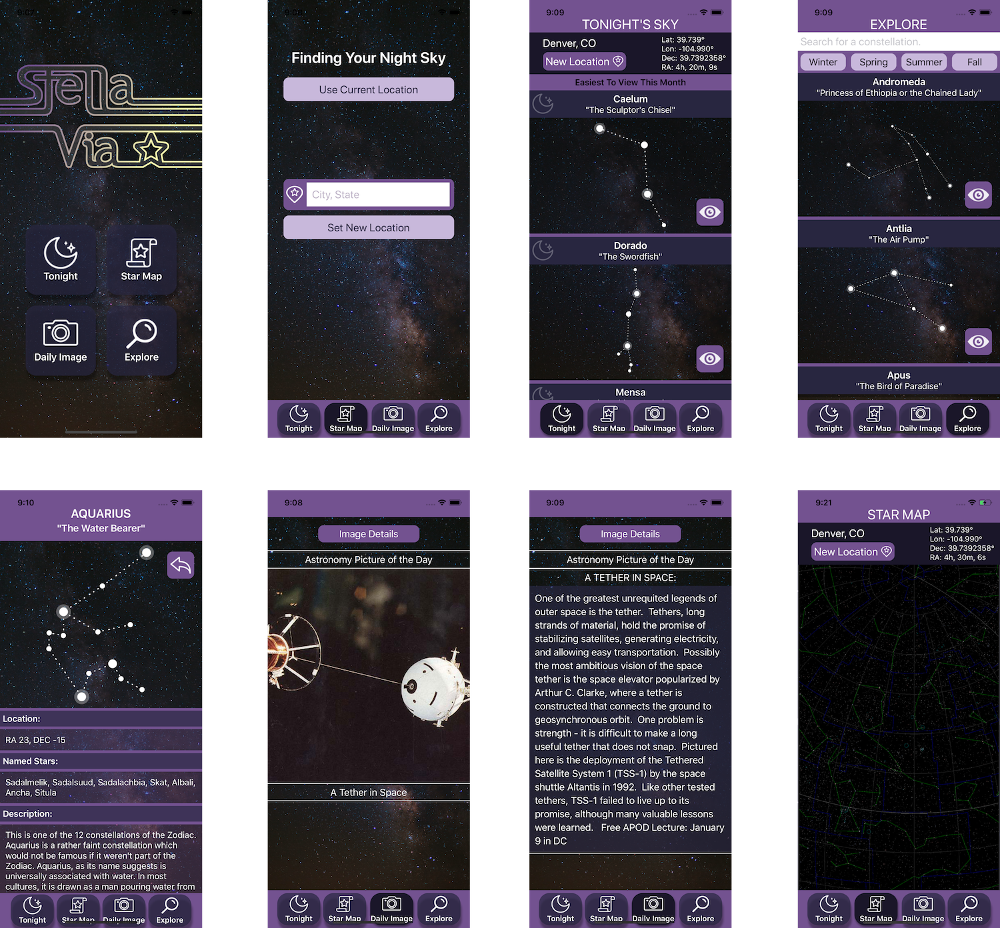
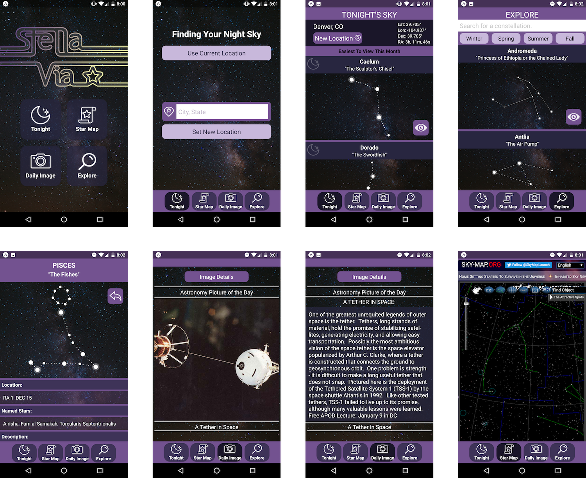

### See a video demo of this project here! https://youtu.be/SO0-MmjgApo

## StellaVia is a 3-week-long, self-directed project made by [@katiescruggs](https://github.com/katiescruggs) and [@julieahawkins](https://github.com/julieahawkins). 
Inspired by the beauty of space, our mission is to make the far-away stars more accessible to people who want to learn more about constellations and become connected to the night sky overhead. 

Over the course of this project, we learned React Native from scratch, how to integrate React Native with Redux, and how to design for a mobile screen (very different than a browser). 

We also learned more about astronomy than we ever thought we would. Stars move in a complicated fashion.

* Tech Stack: React Native, Redux, Jest
* Platforms: Android and iOS
* APIs Used: NASA, Google Geocoding, Navigator Geolocation, wUnderground, Virtual Sky

## iOS View:

## Android View:

